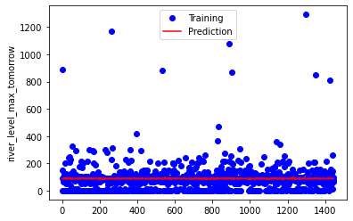
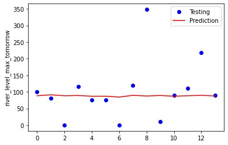

# Rahmat Fajri
**It's My Portfolio**

I am a  fresh graduate from Brawijaya University, majoring in Computational Physics. I have an interest in machine learning and enjoy exploring everything about data. During my university, I continuously find ways to develop my passion and skills such as joining training programs and doing some personal projects. I'm seeking a job with a healthy work environment where I can improve my skills and knowledge efficiently for organizational growth.

## [Customer Churn Prediction](https://github.com/rfajri27/customer_churn)
- Handling invalid customerID, missing values, outliers & not standard values
- Analyzed distribution of churn customers
- Implemented Logistic Regression, Random Forest Classifier, Gradient Boosting Classifier to predict customer churn
- **Tools**: Pandas, Numpy, Scikit-Learn, Matplotlib, Seborn, Github

  

## [Customer Segmentation](https://github.com/rfajri27/customer_segmentation)
- Handling missing values & outliers
- Analyzed customer distribution
- Implemented K-Prototypes algorithm to do customer segmentation
- Identify 5 clusters of customer
- **Tools**: Pandas, Numpy, Scikit-Learn, Matplotlib, Github

  
 

## [Recommender System](https://github.com/rfajri27/recommender_system)
- Handling missing values
- Data preprocessing
- Implemented similarity function to build a recommender system
- Implemented weighted average to build a recommender system
- **Tools**: Pandas, Numpy, Scikit-Learn, GitHub

## [Exploring E-Commerce Data](https://github.com/rfajri27/Exploring_E_Commerce_Data)
- Analyzed product per category, users status, and order status
- Identified top ten most popular products
- **Tools**: Pandas, Numpy, Matplotlib, GitHub

## [Bangkit 2021 Capstone Project: Flood Disaster Warning System](https://github.com/rfajri27/Capstone-Project-B21-CAP0012)
- Analyzed the correlation of weather data and river level
- Created a machine learning model to predict river level based on weather dataset
- Used Deep Neural Network (DNN) as a model
- Deployed the model into Android App using TensorFlow Lite and published on GitHub as an open-source
project
- **Tools**: TensorFlow, Pandas, Numpy,  Matplotlib, GitHub

 

